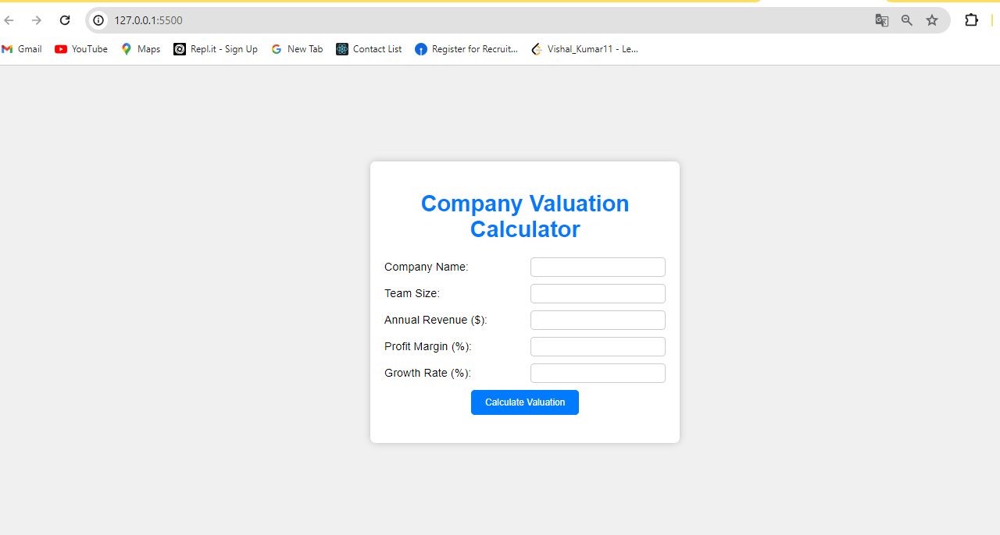
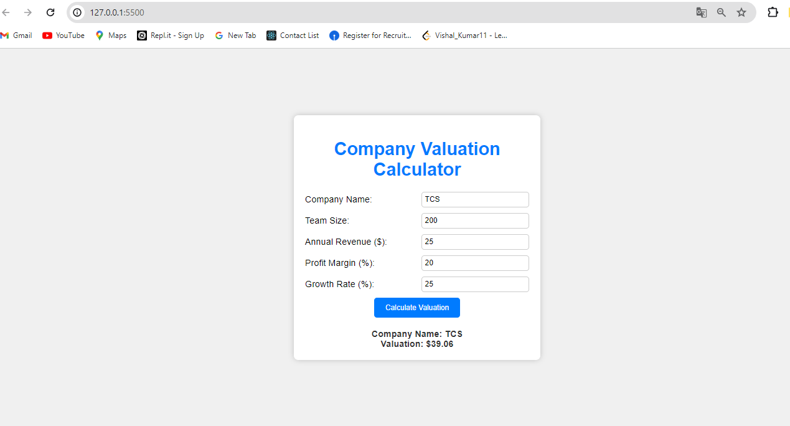

# Company Valuation Calculator

This project is a simple web-based application that calculates the valuation of a company based on user inputs such as team size, annual revenue, profit margin, and growth rate.

## Features

- Input fields for company name, team size, annual revenue, profit margin, and growth rate.
- A button to calculate the company valuation.
- Displays the calculated valuation based on the provided inputs.

## Getting Started

### Prerequisites

To view and run this project, you need a web browser.

### Installation

1. Clone the repository or download the files.
2. Open `index.html` in your web browser.

### Project Structure

- `index.html`: The main HTML file that contains the structure of the valuation calculator.
- `index.css`: The CSS file for styling the application.
- `index.js`: The JavaScript file that contains the logic for calculating the company valuation.

## Usage

1. Open `index.html` in your web browser.
2. Enter the company name, team size, annual revenue, profit margin, and growth rate in the respective input fields.
3. Click the "Calculate Valuation" button.
4. The valuation result will be displayed below the button.

## Code Overview

### HTML

The `index.html` file contains:

- A form for user inputs, including fields for company name, team size, revenue, profit margin, and growth rate.
- A button to trigger the valuation calculation.
- A div to display the result.

### CSS

The `index.css` file contains the styling for the application, making it visually appealing and user-friendly.

### JavaScript

The `index.js` file contains the following functionality:

- Listens for the "DOMContentLoaded" event to ensure the DOM is fully loaded before running the script.
- Adds an event listener to the "Calculate Valuation" button.
- Validates user inputs to ensure all fields contain valid data.
- Calculates the company valuation using the formula:
  \[
  \text{valuation} = \frac{\text{revenue} \times (1 + \text{growthRate})}{1 - \text{profitMargin}}
  \]
- Displays the calculated valuation and company name.

### External Libraries

No external libraries are used in this project. The project relies on standard HTML, CSS, and JavaScript.

## Contributing

If you would like to contribute to this project, please fork the repository and submit a pull request.

## License

This project is open source and available under the [MIT License](LICENSE).

## Acknowledgements

- This project was created as a simple demonstration of basic web technologies.
- Inspired by various online company valuation calculators.

## Output
- #### Before Valuation
  

- #### After Valuation
  